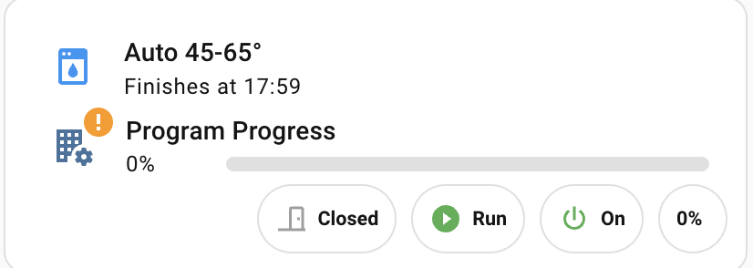
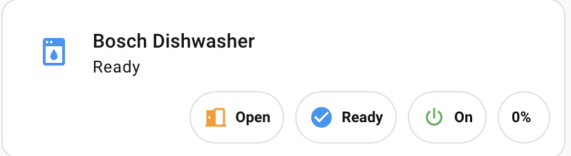
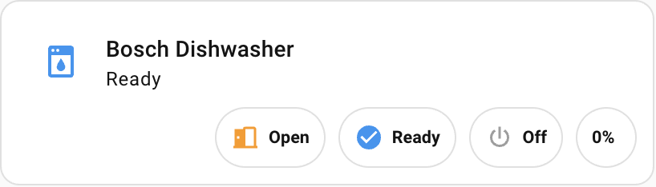
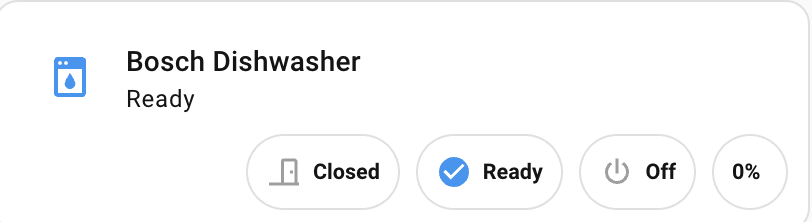

# Bosch Dishwasher Card voor Home Assistant

Een uitgebreide Lovelace kaart voor het monitoren en bedienen van je Bosch Home Connect vaatwasser.



## ✨ Functies

- 📊 **Voortgangsbalk*## 🤝 Bijdragen

Voel je vrij om issues te openen of pull requests in te dienen voor verbeteringen!

## 💡 Tips & Tricks

### Energie Besparing (Daluren)
De Smart Start 23:00 functie is specifiek ontworpen voor Nederlandse daluren (off-peak):
- Standaard starttijd: 23:00 (begin daluren)
- Automatische berekening van vertraging
- Garantie dat het nooit vóór de daluren start
- Bespaart gemiddeld 50% op energiekosten voor vaatwassen

### Automatiseringen
Je kunt extra automatiseringen maken:
- Notificaties wanneer de cyclus voltooid is
- Automatisch starten op basis van zonnepanelen opbrengst
- Integratie met andere smart home apparaten

## 📄 Licentie

Dit project is vrij te gebruiken en aan te passen voor persoonlijk gebruik.uele weergave van de cyclus voortgang
- ⏱️ **Geschatte eindtijd** - Toont wanneer de vaatwasser klaar is (alleen tijdens actieve cyclus)
- 🚪 **Deur status** - Indicator voor open/dichte deur
- ▶️ **Bedieningsstatus** - Toont de huidige operatiestatus (Run, Ready, Finished, etc.)
- 🔌 **Aan/uit schakelaar** - Schakel de vaatwasser aan of uit
- 🏃 **Slimme start/stop knop** - Start het Auto 45-65° programma of stop de lopende cyclus
- ⚡ **Smart Start 23:00** - Automatisch starten om 23:00 voor daluren (goedkoop nachttarief)
- 📈 **Percentage weergave** - Toont de exacte voortgang in procenten
- 📱 **Mobiel vriendelijk** - Responsive ontwerp dat goed werkt op alle apparaten

## 📋 Vereisten

### HACS Custom Cards
Installeer de volgende custom cards via HACS:

1. **stack-in-card**
   - HACS → Frontend → Zoek naar "stack-in-card"
   - [Repository](https://github.com/custom-cards/stack-in-card)

2. **lovelace-entity-progress-card**
   - HACS → Frontend → Zoek naar "entity-progress-card"
   - [Repository](https://github.com/berrywhite96/lovelace-entity-progress-card)

3. **mushroom-cards**
   - HACS → Frontend → Zoek naar "Mushroom"
   - [Repository](https://github.com/piitaya/lovelace-mushroom)

4. **card-mod**
   - HACS → Frontend → Zoek naar "card-mod"
   - [Repository](https://github.com/thomasloven/lovelace-card-mod)

### Integraties

- **Home Connect Alt** - Voor vaatwasser integratie
  - Installeer via HACS → Integraties → Zoek naar "Home Connect Alt"
  - [Repository](https://github.com/ekutner/home-connect-hass)
  - Deze alternatieve integratie biedt betere ondersteuning en meer functionaliteit dan de standaard Home Connect integratie

## 🚀 Installatie

### Stap 1: Template Sensor Configureren

1. Open je Home Assistant configuratie map
2. Als je nog geen `template.yaml` bestand hebt, maak er dan een aan
3. Kopieer de inhoud van [`template.yaml`](template.yaml) naar je bestand
4. Voeg het volgende toe aan je `configuration.yaml` (als je dat nog niet hebt):

```yaml
template: !include template.yaml
```

5. Herstart Home Assistant

### Stap 2: Scripts Toevoegen

#### Script 1: Smart Toggle (Start/Stop)

1. Ga naar **Instellingen** → **Automatiseringen & Scènes** → **Scripts**
2. Klik op **+ Script Toevoegen**
3. Klik rechtsboven op de drie puntjes en kies **Bewerken als YAML**
4. Kopieer de volledige inhoud van [`dishwasher-smart-toggle-script.yaml`](dishwasher-smart-toggle-script.yaml)
5. Plak het in de editor en sla op als `dishwasher_smart_toggle`

#### Script 2: Smart Start 23:00 (Daluren)

1. Klik opnieuw op **+ Script Toevoegen**
2. Klik rechtsboven op de drie puntjes en kies **Bewerken als YAML**
3. Kopieer de volledige inhoud van [`dishwasher-smart-start-script.yaml`](dishwasher-smart-start-script.yaml)
4. Plak het in de editor en sla op als `dishwasher_smart_start_23_00`

### Stap 3: Dashboard Card Toevoegen

1. Open je Home Assistant dashboard
2. Klik rechtsboven op de drie puntjes → **Dashboard bewerken**
3. Klik op **+ Kaart toevoegen**
4. Scroll helemaal naar beneden en klik op **Handmatig**
5. Kopieer de volledige inhoud van [`dishwasher-card.yaml`](dishwasher-card.yaml)
6. Plak het in de editor
7. Klik op **Opslaan**

## 🔧 Aanpassen

### Entity ID's Wijzigen

Als je vaatwasser andere entity ID's heeft, pas dan de volgende regels aan in `dishwasher-card.yaml`:

```yaml
sensor.dishwasher_program_progress          # Voortgang percentage
sensor.dishwasher_minutes_remaining         # Resterende minuten
sensor.dishwasher_active_program            # Actief programma
sensor.dishwasher_operation_state           # Bedieningsstatus
sensor.dishwasher_bsh_common_setting_powerstate  # Aan/uit status
binary_sensor.dishwasher_bsh_common_status_doorstate  # Deur status
switch.dishwasher_power                     # Aan/uit schakelaar
select.dishwasher_programs                  # Programma selectie
button.dishwasher_start_pause               # Start/pauze knop
button.dishwasher_stop                      # Stop knop
```

### Programma's Aanpassen

Om andere programma's toe te voegen of te wijzigen, bewerk de `program_map` in `dishwasher-card.yaml`:

```yaml

```

### Standaard Start Programma Wijzigen

Het script start standaard het **Auto 45-65°** (Auto2) programma. Om dit te wijzigen, pas de volgende regel aan in beide script bestanden:

**In `dishwasher-smart-toggle-script.yaml`:**
```yaml
data:
  option: Dishcare.Dishwasher.Program.Auto2  # Wijzig naar gewenst programma
```

**In `dishwasher-smart-start-script.yaml`:**
```yaml
data:
  option: Dishcare.Dishwasher.Program.Auto2  # Wijzig naar gewenst programma
```

### Smart Start Tijd Aanpassen

Om een andere starttijd dan 23:00 te gebruiken, pas de volgende regel aan in `dishwasher-smart-start-script.yaml`:

```yaml

```

Verander `hour=23` naar het gewenste uur (bijvoorbeeld `hour=22` voor 22:00).

### Kleuren Aanpassen

Pas de kleuren aan in `dishwasher-card.yaml`:

```yaml
bar_color: '#5E8FCC'        # Voortgangsbalk kleur
icon_color: blue            # Hoofdicoon kleur
```

Status kleuren:
- **Groen** - Actief/Aan
- **Oranje** - Pauze/Deur open
- **Blauw** - Ready
- **Paars** - Afgerond
- **Rood** - Fout/Actie vereist
- **Grijs** - Inactief/Uit

## 📸 Screenshots

### Vaatwasser Actief met Voortgang

*Vaatwasser tijdens een actieve cyclus met voortgangsbalk en geschatte eindtijd*

### Vaatwasser Klaar - Deur Open

*Vaatwasser aan met deur open - oranje indicator toont deur status*

### Vaatwasser Uit - Deur Open

*Vaatwasser uitgeschakeld, deur status wordt nog steeds weergegeven*

### Vaatwasser Klaar - Deur Dicht

*Vaatwasser in standby modus, deur gesloten en klaar om te starten*

## 🎯 Gebruik

### Start/Stop Knop (Operation State Chip)
- **Enkele tik**: Start Auto 45-65° programma of stop de lopende cyclus
- **Dubbele tik**: Pauzeert/hervat de huidige cyclus

### Smart Start 23:00 Knop ⚡
- **Enkele tik**: Plant het starten van de vaatwasser om 23:00 (daluren)
- **Voordeel**: Profiteer van goedkoop nachttarief elektriciteit
- **Hoe het werkt**: 
  - Rond altijd NAAR BOVEN af naar het dichtstbijzijnde 30-minuten interval
  - Garandeert dat de vaatwasser nooit vóór 23:00 start
  - Bijv. als je om 22:23 drukt, start hij om 23:23
  - Als het al na 23:00 is, start hij onmiddellijk

### Aan/Uit Knop
- **Tik**: Schakel de vaatwasser aan of uit

### Deur Status
- **Grijs**: Deur is dicht
- **Oranje**: Deur is open

### Bedieningsstatus
- **Run** (Groen): Vaatwasser is actief bezig
- **Ready** (Blauw): Klaar om te starten
- **Finished** (Paars): Cyclus is voltooid
- **Pause** (Oranje): Cyclus is gepauzeerd
- **Delayed** (Cyaan): Vertraagde start (Smart Start actief)
- **Error** (Rood): Fout opgetreden

## 🐛 Probleemoplossing

### De kaart toont "unavailable"
- Controleer of de Home Connect Alt integratie correct is geconfigureerd
- Zorg dat je vaatwasser is ingeschakeld en verbonden met WiFi
- Verifieer de entity ID's in de kaart configuratie

### Het script werkt niet
- Controleer of beide scripts correct zijn opgeslagen in Home Assistant
- Verifieer dat `script.dishwasher_smart_toggle` en `script.dishwasher_smart_start_23_00` bestaan
- Check de entity ID's van de knoppen in de scripts

### Smart Start 23:00 start niet op de juiste tijd
- De vaatwasser gebruikt 30-minuten intervallen (0:00, 0:30, 1:00, etc.)
- Het script rondt altijd NAAR BOVEN af om te garanderen dat het niet vóór 23:00 start
- Controleer of `select.dishwasher_bsh_common_option_startinrelative` beschikbaar is

### De voortgangsbalk wordt niet weergegeven
- De voortgangsbalk wordt automatisch verborgen wanneer de vaatwasser uit staat of geen cyclus actief is
- Controleer of `sensor.dishwasher_program_progress` beschikbaar is

### "Program Progress" tekst loopt over de kaart
- Dit zou al opgelost moeten zijn met de korte naam
- Controleer je browser cache en ververs de pagina

## 🤝 Bijdragen

Voel je vrij om issues te openen of pull requests in te dienen voor verbeteringen!

## 📄 Licentie

Dit project is vrij te gebruiken en aan te passen voor persoonlijk gebruik.

## 👏 Credits

Gemaakt met ❤️ voor de Home Assistant community

---

**Vragen of problemen?** Open een issue op GitHub!
